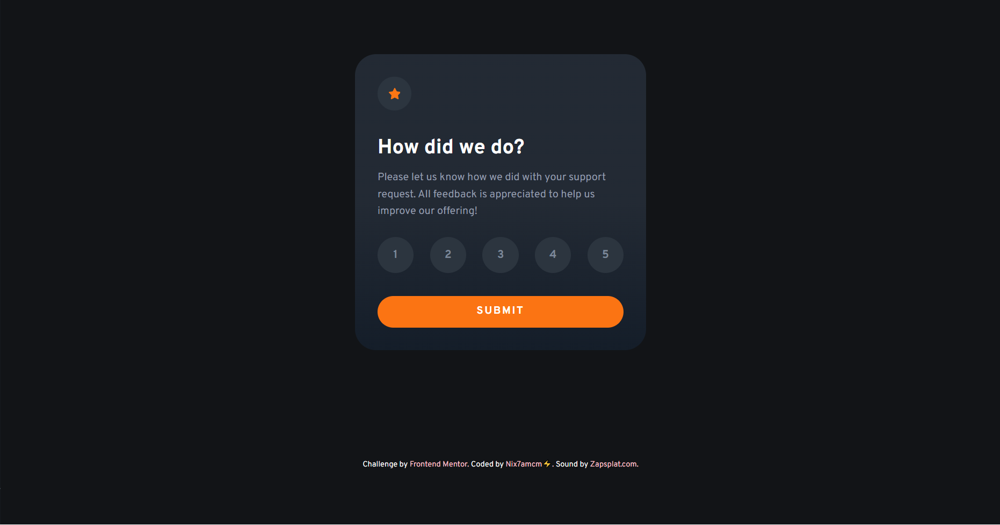
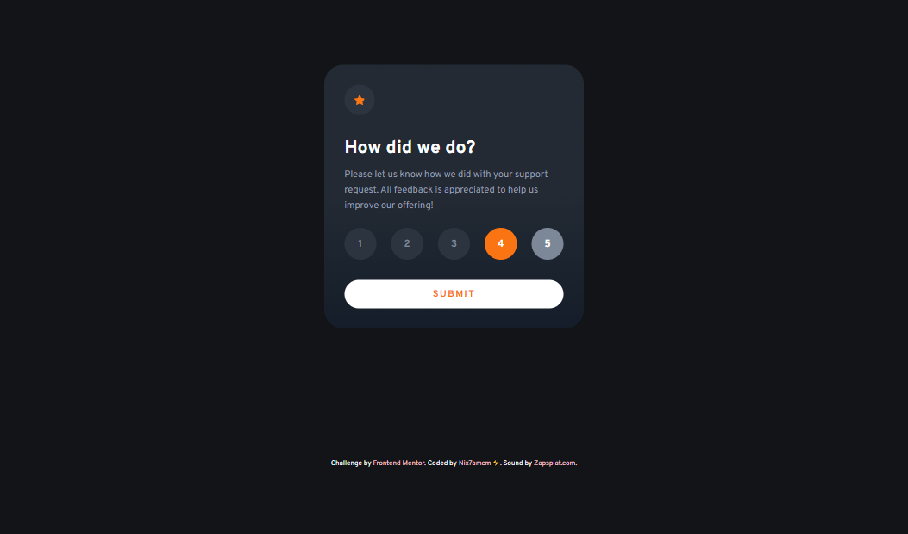
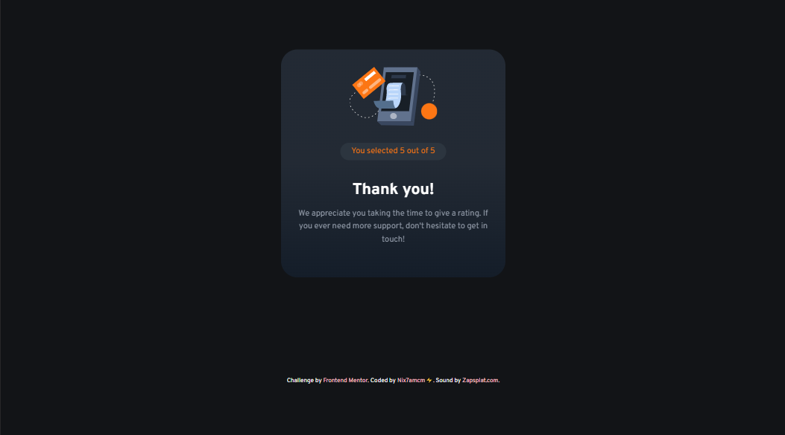
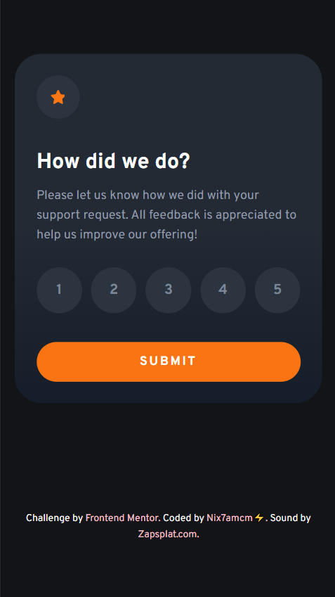
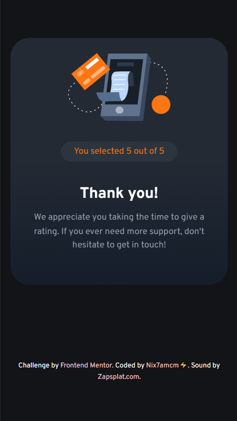

# Frontend Mentor - Interactive rating component solution

This is my solution to the [Interactive rating component challenge on Frontend Mentor](https://www.frontendmentor.io/challenges/interactive-rating-component-koxpeBUmI).

## Table of contents

- [Overview](#overview)
  - [Challenge Requirements](#challenge-requirements)
- [Screenshots](#screenshots)
- [Links](#links)
- [My process](#my-process)
  - [Built with](#built-with)
  - [Useful resources](#useful-resources)
- [Author](#author)
- [Acknowledgments](#acknowledgments)

---

## Overview

👩🏻‍💻 [Frontend Mentor](www.frontendmentor.io) challenges help you improve your coding skills by building realistic projects.

⚡ This challenge was to build a rating submission card compenent, where the DOM is updated using JS when the user interacts with the elements.

🚀 I built this with the help of [Andreas Remdt's live code video](https://www.youtube.com/@AndreasRemdt), mainly for the JS! I learned a lot about adding the user interaction in simple ways, also animation implementation and even adding sounds! I also picked up useful tips on responsiveness and accessibility.

### Challenge Requirements

Users should be able to:

- View the optimal layout for the app depending on their device's screen size
- See hover states for all interactive elements on the page
- Select and submit a number rating
- See the "Thank you" card state after submitting a rating

---

## Screenshots

---

## Links

- Solution URL: [www.frontendmentor.io/solutions/interactive-rating-component-qdfWiQmO4b](https://www.frontendmentor.io/solutions/interactive-rating-component-qdfWiQmO4b)
- Live Site URL: [nix7amcm.github.io/FEM-interactive-rating-component/](https://nix7amcm.github.io/FEM-interactive-rating-component/)

---

## My process

### Built with

- Semantic HTML5 markup
- CSS custom properties
- CSS Grid
- JS

### Useful resources

- [Tailwind.css](https://tailwindcss.com/) - This helped me add [fallback fonts](https://tailwindcss.com/docs/font-family) to cover all browsers, and the [sr-only](https://tailwindcss.com/docs/screen-readers#screen-reader-only-elements) class styles for accessibility.
- [Zapsplat.com](https://www.zapsplat.com/) - This is an amazing resource for downloading free sounds to use in your projects! Don't forget to credit them!

---

## Author

- Website - [Nix7amcm](https://github.com/Nix7amcm)
- Frontend Mentor - [@Nix7amcm](https://www.frontendmentor.io/profile/Nix7amcm)
- LinkedIn - [amcm-8807](https://www.linkedin.com/in/amcm-8807/)

---

## Acknowledgments

Shoutout to [Andreas Remdt](https://www.youtube.com/@AndreasRemdt). Really learned a lot from his video! Thanks! 😃